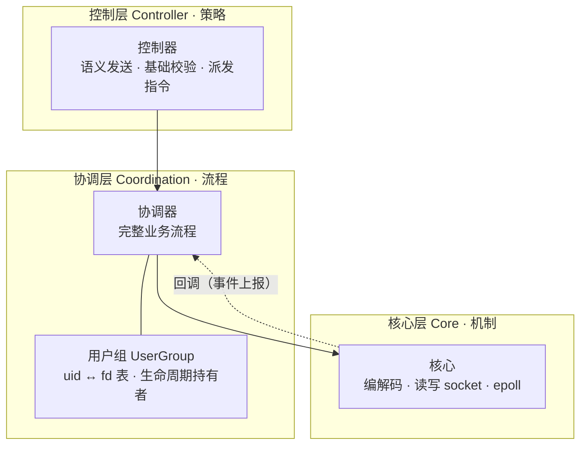

# com_lite 架构设计（第一版）

一个跑在 Linux 服务器上的即时通信服务端。本文件记录第一版的分层设计与层间纪律，作为后续拆分与实现的依据。

## 1. 现状

当前代码是一个可运行的最小原型，全部逻辑集中在单个函数里：

- `src/main.cpp`（约 107 行）：一个基于 epoll 的 TCP 回显服务端，已实测支持多客户端并发连接。socket 创建、`bind`/`listen`、非阻塞设置、epoll 事件循环、`accept` 新连接、读数据并原样回写，全部内联在 `main()` 中。这是本设计要拆分的对象。
- `src/core/core.h`、`src/core/core.cpp`：空骨架（`namespace core { class Core {}; }`），尚未填充。
- `src/common/message.h`：已起草的消息类型——`MessageBase`（`from_uid_` / `to_uid_` / `chat_type_` / `client_msg_id_` / `msg_type_`），以及 `RequestMsg`、`ResponseMsg`。
- `src/common/io_status.h`：`IoStatus` 枚举（`Ok` / `Closed` / `WouldBlock` / `Interrupted` / `LineTooLong` / `Timeout` / `Error`）及 `toString`。该文件从其它项目复制而来，部分枚举值的语义在本项目中被重新赋义（见 §2.4）。

`main()` 里数据实际经过一条表示形式不断变化的链路，每一次形式变化就是一条应被切开的边界：

```
fd + 事件   →   字节流   →   一帧一帧   →   Message   →   业务决策
 (epoll)      (读缓冲)      (按帧切分)     (消息类型)     (该怎么回应)
```

原型把这几条边界全部焊死在 `main()` 中，因此无法独立演进。第一版设计的目标就是沿这些边界把职责拆开。

## 2. 三层架构

自顶向下分为三层：**控制层（策略）→ 协调层（流程）→ 核心层（机制）**。每一层只依赖其下一层暴露的接口，不知道下层的内部实现。



依赖关系（实线箭头）始终自上而下；核心层向上传递事件通过**回调**完成（虚线），核心层不在编译期依赖上层类型。

### 2.1 控制层（Controller）

- **职责**：仅做"语义上的发送"，即接收一个请求、做最基础的条件判断（例如"不能发送空消息"），然后向协调层下达指令。它**不是真正的执行者**，不知道每一步具体如何完成。
- **对用户的操作**：通过协调层的**用户组**间接进行（例如查询、校验用户状态），控制层自身不持有用户状态。
- **典型内容**：入口校验、按 `msg_type_` 判定请求类别、把请求转交给协调层对应的流程。

### 2.2 协调层（Coordination）

- **职责**：真正执行业务流程的一层。它知道**完整流程**（例如"把一条消息送达对端"需要哪些步骤），但**不知道也不需要知道数据在底层如何流动**，不关心硬件与 socket 细节。它只与 `Message` 以及"把某段数据交给核心层写到某个 fd"这样的抽象打交道。
- **用户组（UserGroup）**：协调层的组成部分，存储每个用户的连接信息。一个 `uid` 可对应**多个 `fd`**（同一用户多设备 / 多连接在线），即 uid → fd 集合的一对多映射。
  - **路由决策由此层完成**：由 `to_uid_` 查出该用户当前的 fd 集合，向其中每个 fd 分发（fan-out），是业务判断，属于协调层，**不下沉到核心层**。
  - **该映射的生命周期由用户组持有并控制**。核心层不持有、也不读取它（见 §3.2）。

### 2.3 核心层（Core）

- **职责**：不关心任何业务逻辑。只负责：消息的**编码 / 解码**、按上层给定的 fd **读写数据**、驱动 epoll 事件循环。当前 `main.cpp` 中的 socket 装配、epoll 循环、accept、读写系统调用都归入这一层。
- **数据来源无感知**：核心层读到的数据来自哪个用户、要发往哪个用户，均由协调层决定并驱动；核心层只面对一个具体的 fd，不追问"这个 fd 是谁"。
- **`IoStatus` 的归属**：核心层的读写操作以 `IoStatus` 报告结果（`WouldBlock` / `Closed` / `LineTooLong` 等），交由上层据此决策。

### 2.4 分帧协议（帧格式）

为解决 TCP 字节流的粘包 / 拆包问题，采用**固定头（8 字节）+ 可变体**的帧结构。编解码由核心层完成。

**帧头布局（固定 8 字节）**

| 偏移 | 长度 | 字段 | 类型 | 说明 |
|---|---|---|---|---|
| 0 | 1 | `opcode` | `enum class : uint8_t` | 帧用途（登录 / 聊天 / 心跳 …），互斥枚举值 |
| 1 | 1 | reserved | — | 保留，发送填 0、接收忽略 |
| 2 | 1 | `status` | `enum class : uint8_t` | 状态 / 结果码枚举值；主要用于响应方向，请求侧填 0 |
| 3 | 1 | reserved | — | 保留，发送填 0、接收忽略 |
| 4–7 | 4 | `body_len` | `uint32`，网络字节序（大端） | 可变体（Body）的字节数，**不含头** |

- **字节序**：`body_len` 一律网络字节序（大端），发送 `htonl`、接收 `ntohl`。
- **opcode / status 用 `enum class`（限定作用域枚举）并显式指定底层类型 `uint8_t`**：恰好 1 字节、与线上字段等宽；阻断隐式 `enum → int` 转换，避免不同枚举混比或误入算术。线上字节 ↔ 枚举必须显式 `static_cast`，且**解码器须先校验读到的字节是已知枚举值**——未知 opcode / status 一律当协议错误拒绝（`IoStatus::Error`），不盲信线上字节。
- **opcode 的用途**：核心层无需反序列化包体即可知道帧用途，可据此做早期分派（例如心跳无需走完整反序列化）；控制层按此字段判定请求类别。
- **可变体（Body）**：`Message` 序列化后的字节，采用 **JSON** 序列化（demo 性质，优先可读与实现简单）。

**收帧流程（核心层）**：读满 8 字节帧头 → 取 opcode / status（校验为已知枚举）、`ntohl` 解出 `body_len` → 校验 `body_len` 不超过上限常量 `MAX_BODY_LEN`（取值待定；超过则以 `IoStatus::LineTooLong` 拒绝 / 关闭连接）→ 按 `body_len` 读满包体 → 反序列化为 `Message` 上交。长度被显式声明，切分不依赖分隔符，能准确处理连续到达（粘包）或被拆分（拆包）的字节流。

**实现注意**：不要把 `Header*` 直接 `reinterpret_cast` 到收到的字节缓冲上（字节序、对齐、strict-aliasing、结构体 padding 都有坑，`sizeof` 也不保证跨平台为 8）。应逐字段解析：按偏移取 opcode / status，`body_len` 用 `memcpy` 取 4 字节再 `ntohl`。

> 说明：`io_status.h` 由其它项目复制而来，`LineTooLong` 原指按行读取时的行超长；在本项目中它被重新赋义为"帧体长度超过上限"。若担心歧义，可后续重命名（例如 `FrameTooLong`）。部分枚举值（如 `Interrupted` / `Timeout`）是否启用取决于最终读写实现。

### 2.5 消息对象的生命周期与所有权

`Message`（`RequestMsg` / `ResponseMsg`）建模为**单一所有者、单次消费**的值对象，语义上模仿移动：一条消息被创建一次、消费一次，不共享、不复制。由于中间隔着网络，这个"移动"由编解码器在两端物理实现：

- **入站 `RequestMsg`**：客户端创建 → 序列化为字节过网 → 服务端**解码器重建**出 `RequestMsg` → 业务层（控制层 / 协调层）消费一次。
- **出站 `ResponseMsg`**：协调层创建 → 服务端**编码器消费**（读取字段序列化为字节）→ 过网 → 客户端重建。

即"编码器消费、解码器重建"是这条移动链在网络两端的落点。

**所有权取向**：要在 C++ 里真正兑现移动语义，消息字段应为**持有所有权的类型**（如 `std::string`）。`const char*` 无法表达所有权、也无法真正 move（拷贝它只拷贝指针、不转移所指数据）。让解码器重建出**自持数据**的消息对象，还能保证字节缓冲的生命周期不跨层——核心层的解码缓冲用完即可释放，向上交出的 `Message` 自成一体。因此 `message.h` 的字段**由 `const char*` 改为 `std::string`**（已定）。若后续出现性能瓶颈，再考虑 `std::string_view` 等零拷贝视图优化，但需自行保证被视图字节的生命周期覆盖消费路径。

## 3. 层间纪律

分层能否长期立住，取决于以下几条边界纪律。它们是本设计的核心约束。

### 3.1 依赖方向始终朝下

epoll 在核心层，数据到达时由核心层先拿到并解码，再向上交付。为避免核心层反向依赖上层：

- 上层把**回调 / 接口**注册进核心层（"解出一条 `Message` 就调用这个回调"、"某个 fd 断开就调用这个回调"）。
- 核心层只认识这些回调 / 接口，不 `#include` 控制层或协调层的具体类型。

这样依赖箭头永远从上层指向下层。

### 3.2 fd 随数据一起流动，核心层不碰用户组表

核心层**不持有、也不读取** uid ↔ fd 表。fd 作为数据的一部分在层间传递：

- **入站（核心层 → 上层）**：epoll 报告 `fd` 可读 → 核心层读字节、解码 → 把 `(fd, Message)` 整体上交。`from_uid_` 本就在报文内，认人由协调层用用户组完成。
- **出站（上层 → 核心层）**：协调层决定发往 `uid=X` → 查用户组得到 X 名下的 fd 集合 → 逐个告知核心层"把这段字节写到该 fd"。

两个方向上核心层都只经手具体的 fd，uid ↔ fd 表**始终只有用户组一个持有者**。这样可以从设计上消除核心层对该表做只读越界 / 指针偏移 / 生命周期错位的整类风险。

### 3.3 Message 是三层共同契约

`Message` 相关类型（`MessageBase` / `RequestMsg` / `ResponseMsg`）是三层之间传递的数据契约：核心层编解码要认识它，协调层执行流程也要认识它。因此它不归任何单独一层所有，放在 `src/common/`（与当前位置一致）。

### 3.4 连接生命周期与 fd 复用

fd 会被操作系统回收复用，这是即时通信服务端最典型的串消息事故来源，必须在设计层面约束：

- 一条连接的生命周期为三段，全部由协调层驱动，核心层只在两端上报事件：
  1. **被 accept（匿名）**：新连接建立，此时尚不知道对应哪个用户。
  2. **登录后绑定 uid**：协调层处理完登录 / 握手指令后，才把该 `fd` 加入对应 `uid` 名下（一个 uid 可持有多个 fd）。绑定发生在登录时，**不在 accept 时**。
  3. **断开时解绑**：连接关闭时，必须从用户组移除该 `fd`；若该 uid 名下已无任何 fd，则该用户转为离线。
- **断开清理路径**：核心层探测到 fd 结束（EOF / 出错）时，只向上报告"某个 fd 断了"（机制）；由协调层收到后从用户组移除该 fd（业务）。核心层不自行改表。
- **失效后果**：若断开后未及时移除失效的 fd，而该 fd 被新连接复用，向原用户发送的数据会被错误地送到新客户端。该纪律用于防止此类事故。

## 4. 数据流走查

以"用户 A 向用户 B 发送一条消息"为例：

1. B、A 分别在各自登录时由协调层登记进用户组；若 B 有多台设备在线，其 `uidB` 名下会有多个 fd。
2. A 的连接（`fdA`）可读，核心层读字节、解码出 `RequestMsg`，将 `(fdA, msg)` 上交。
3. 控制层做基础校验（如内容非空），判定为发送类指令，交给协调层的发送流程。
4. 协调层取 `msg.to_uid_ == uidB`，向用户组查得 B 名下的 fd 集合，构造 `ResponseMsg`，逐个交给核心层："编码并写到 fd=N"。
5. 核心层对每个 fd 编码并写入，以 `IoStatus` 报告结果（如 `WouldBlock` 时的处理策略由上层决定）。

全程中核心层从未接触用户组的映射，只面对上层交下来的具体 fd。

## 5. 从原型到分层的迁移路线

分步进行，不要求一次到位：

1. **抽出 socket + epoll 装配**：把 `main.cpp` 中的监听 socket 创建与 epoll 循环搬入核心层。`main()` 收敛为"构建核心层 → 运行"。这是最机械、最安全的一刀。
2. **每条客户端连接对象化**：以连接对象（持有 fd 与读 / 写缓冲）替代原型中裸 `buf` 与"发完不管"的 `send`。读写返回接入 `IoStatus`。此步同时修正原型中"写返回 `EAGAIN` 时静默丢数据"的问题。
3. **插入编解码（帧切分）**：在核心层读缓冲的字节与 `Message` 之间加入分帧，采用固定头 + 可变体的帧结构（见 §2.4）。此步同时接入粘包 / 拆包处理与超长帧防护（`IoStatus::LineTooLong`）。
4. **落业务与用户组**：协调层（含用户组）承接完整流程，控制层承接入口校验与派发。当前的回显行为在此替换为按 `uid` 的真实路由。改动这两层时，核心层无需改动。

## 6. 待定项

- **登录 / 握手协议**（未决）：uid ↔ fd 绑定发生在登录时，登录指令的具体形态（认证方式、`msg_type_` 取值）尚未定义。
- **`MAX_BODY_LEN` 取值**（未决）：超长帧防护的上限常量已定为机制（§2.4），具体数值待定。
- **离线消息暂存**（暂不实现）：目标 uid 当前无在线 fd 时的处理暂不落地，仅在协调层预留接口占位；未来可能以数据库承接。分层边界不受影响。

> 已敲定并移入正文的原待定项：序列化采用 JSON（§2.4）；消息对象按单一所有者 / 单次消费的移动语义建模，字段改为 `std::string`（§2.5）。
