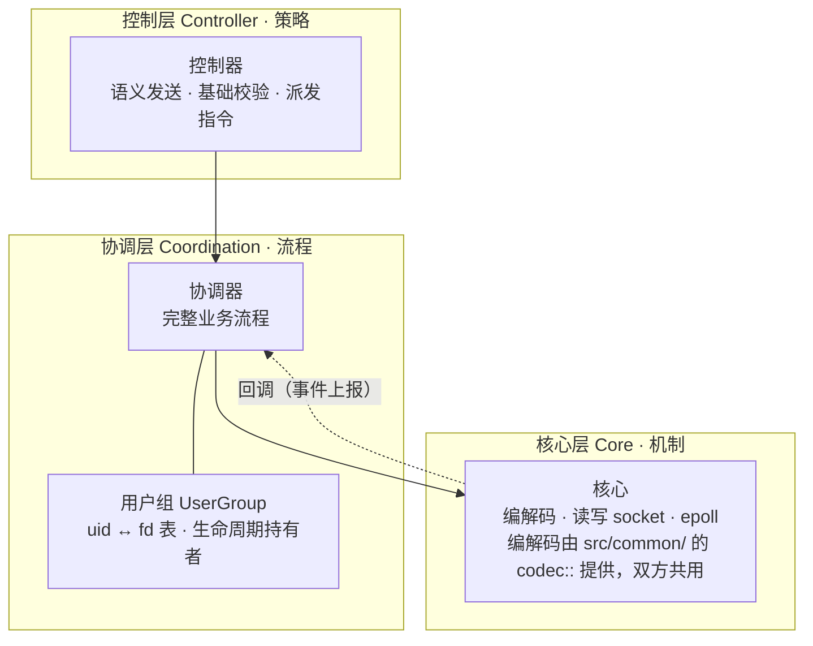

# com_lite 架构设计（第一版）

一个跑在 Linux 服务器上的即时通信服务端。本文件记录第一版的分层设计与层间纪律，作为后续拆分与实现的依据。

## 1. 现状

原型阶段的全部逻辑集中在单个 `main()` 里。数据在其中经过一条表示形式不断变化的链路，每一次形式变化就是一条应被切开的边界：

```
fd + 事件   →   字节流   →   一帧一帧   →   Message   →   业务决策
 (epoll)      (读缓冲)      (按帧切分)     (消息类型)     (该怎么回应)
```

原型把这几条边界全部焊死在 `main()` 中，因此无法独立演进。第一版设计的目标就是沿这些边界把职责拆开。**§5 迁移路线的前三步已完成**，当前目录结构如下：

```
src/
  common/      三层与客户端共同的契约类型
    message.h        Message（消息值对象）、ChatTypes / MessageTypes
    frame_header.h   FrameHeader（帧头 + 编译期 wire_size）
    message_pack.h   MessagePack（FrameHeader + Message）
    io_status.h      IoStatus 枚举及 toString
    binary_code.h    Opcode / Status 及其线上字节值域校验
    encoder.h        Encoder（MessagePack → 线上字节）
    decoder.h        Decoder（线上字节 → MessagePack）
  server/
    main.cpp         装配 Core / Controller，注册回调，run()
    core/            connections.*（连接对象与读写缓冲）、core.*（epoll 事件循环）
    controller/      controller.h（按 opcode 派发，当前仍为回显）
    coordination/    user.h、users_group.h、assembler.h（后两者尚为骨架）
  client/
    main.cpp         调试用客户端：连接 → 编码发一帧 → 打印回显
include/       json.hpp（第三方单头文件库）
tests/         ctest 目标，见 §6
```

头文件搜索根全项目只有两个——`src/` 与 `include/`，由 CMake 的 `com_lite_base` INTERFACE 目标统一提供，其余目标一律通过 `target_link_libraries` 继承。因此**同一个头文件在任何位置只有一种写法**：从 `src/` 起的完整路径，如 `"common/encoder.h"`、`"server/core/core.h"`，不使用相对路径。

`src/common/io_status.h` 从其它项目复制而来，部分枚举值的语义在本项目中被重新赋义（见 §2.4）。

## 2. 三层架构

自顶向下分为三层：**控制层（策略）→ 协调层（流程）→ 核心层（机制）**。每一层只依赖其下一层暴露的接口，不知道下层的内部实现。


```mermaid
flowchart TD
    subgraph L1[控制层 Controller · 策略]
        C[控制器<br/>语义发送 · 基础校验 · 派发指令]
    end
    subgraph L2[协调层 Coordination · 流程]
        O[协调器<br/>完整业务流程]
        U[用户组 UserGroup<br/>uid ↔ fd 表 · 生命周期持有者]
    end
    subgraph L3[核心层 Core · 机制]
        K[核心<br/>编解码 · 读写 socket · epoll<br/>编解码由 src/common/ 的 codec:: 提供，双方共用]
    end
    C --> O
    O --- U
    O --> K
    K -. 回调（事件上报） .-> O
```

依赖关系（实线箭头）始终自上而下；核心层向上传递事件通过**回调**完成（虚线），核心层不在编译期依赖上层类型。

### 2.1 控制层（Controller）

- **职责**：仅做"语义上的发送"，即接收一个请求、做最基础的条件判断（例如"不能发送空消息"），然后向协调层下达指令。它**不是真正的执行者**，不知道每一步具体如何完成。
- **对用户的操作**：通过协调层的**用户组**间接进行（例如查询、校验用户状态），控制层自身不持有用户状态。
- **典型内容**：入口校验、按 `msg_type_` 判定请求类别、把请求转交给协调层对应的流程。

### 2.2 协调层（Coordination）

- **职责**：真正执行业务流程的一层。它知道**完整流程**（例如"把一条消息送达对端"需要哪些步骤），但**不知道也不需要知道数据在底层如何流动**，不关心硬件与 socket 细节。它只与 `Message` 以及"把某段数据交给核心层写到某个 fd"这样的抽象打交道。
- **用户组（UserGroup）**：协调层的组成部分，存储每个用户的连接信息。一个 `uid` 可对应**多个 `fd`**（同一用户多设备 / 多连接在线），即 uid → fd 集合的一对多映射。
  - **路由决策由此层完成**：由 `to_uid_` 查出该用户当前的 fd 集合，向其中每个 fd 分发（fan-out），是业务判断，属于协调层，**不下沉到核心层**。
  - **该映射的生命周期由用户组持有并控制**。核心层不持有、也不读取它（见 §3.2）。

### 2.3 核心层（Core）

- **职责**：不关心任何业务逻辑。只负责：消息的**编码 / 解码**、按上层给定的 fd **读写数据**、驱动 epoll 事件循环。当前 `main.cpp` 中的 socket 装配、epoll 循环、accept、读写系统调用都归入这一层。其中编解码只是**逻辑分层**上属于本层，实现（`codec::Encoder` / `codec::Decoder`）位于 `src/common/`，由通信双方共用（见 §3.3）。
- **数据来源无感知**：核心层读到的数据来自哪个用户、要发往哪个用户，均由协调层决定并驱动；核心层只面对一个具体的 fd，不追问"这个 fd 是谁"。
- **`IoStatus` 的归属**：核心层的读写操作以 `IoStatus` 报告结果（`WouldBlock` / `Closed` / `FrameTooLong` 等），交由上层据此决策。

### 2.4 分帧协议（帧格式）

为解决 TCP 字节流的粘包 / 拆包问题，采用**固定头（6 字节）+ 可变体**的帧结构。编解码在逻辑分层上仍归核心层，实现位于 `src/common/` 的 `codec::`，通信双方共用。

**帧头布局（固定 6 字节）**

| 偏移 | 长度 | 字段 | 类型 | 说明 |
|---|---|---|---|---|
| 0 | 1 | `opcode` | `enum class : uint8_t` | 帧用途，互斥枚举值 |
| 1 | 1 | `status` | `enum class : uint8_t` | 状态 / 结果码枚举值 |
| 2–5 | 4 | `body_len` | `uint32`，网络字节序（大端） | 可变体字节数，**不含头** |

- **字节序**：`body_len` 一律网络字节序（大端），发送 `htonl`、接收 `ntohl`。
- **opcode / status 用 `enum class`（限定作用域枚举）并显式指定底层类型 `uint8_t`**：恰好 1 字节、与线上字段等宽；阻断隐式 `enum → int` 转换，避免不同枚举混比或误入算术。线上字节 ↔ 枚举必须显式 `static_cast`，且**解码器须先校验读到的字节是已知枚举值**——未知 opcode / status 一律当协议错误拒绝（`IoStatus::Error`），不盲信线上字节。
- **opcode 的用途**：核心层无需反序列化包体即可知道帧用途，可据此做早期分派（例如心跳无需走完整反序列化）；控制层按此字段判定请求类别。
- **可变体（Body）**：`Message` 序列化后的字节，采用 **JSON** 序列化（demo 性质，优先可读与实现简单）。

**收帧流程（核心层）**：读满 6 字节帧头 → 取 opcode / status（校验为已知枚举）、`ntohl` 解出 `body_len` → 校验 `body_len` 不超过上限常量 `max_message_body_length`（65530，见 `common/message.h`）；超过则以 `IoStatus::FrameTooLong` 拒绝，连接级处置（丢弃后续字节 / 关闭连接）仍待分帧状态机落地 → 按 `body_len` 读满包体 → 反序列化为 `Message` 上交。长度被显式声明，切分不依赖分隔符，能准确处理连续到达（粘包）或被拆分（拆包）的字节流。

**实现注意**：不要把 `Header*` 直接 `reinterpret_cast` 到收到的字节缓冲上（字节序、对齐、strict-aliasing、结构体 padding 都有坑，`sizeof` 也不保证跨平台为 6）。应逐字段解析：按偏移取 opcode / status，`body_len` 用 `memcpy` 取 4 字节再 `ntohl`。

> 说明：原枚举值 `LineTooLong` 指按行读取时的行超长；本项目中已重命名为 `FrameTooLong`，语义为"帧体长度超过上限"。部分枚举值（如 `Interrupted` / `Timeout`）是否启用取决于最终读写实现。

### 2.5 消息对象的生命周期与所有权

`Message` 建模为**单一所有者、单次消费**的值对象，语义上模仿移动：一条消息被创建一次、消费一次，不共享、不复制。由于中间隔着网络，这个"移动"由编解码器在两端物理实现：

- **入站**：客户端创建 → 序列化为字节过网 → 服务端**解码器重建**出 `Message` → 业务层（控制层 / 协调层）消费一次。
- **出站**：协调层创建 → 服务端**编码器消费**（读取字段序列化为字节）→ 过网 → 客户端重建。

**请求 / 响应不再由类型区分**。原设计以 `MessageBase` 为基类派生 `RequestMsg`（含 `content_`）与 `ResponseMsg`（含 `server_seq_`），现塌缩为单个 `Message`，`content_` 上提为公共字段。帧的用途改由帧头的 `opcode` 单独承载（§2.4）——一条帧是请求还是响应，是**线上协议**的事实，不必在 C++ 类型系统里再表达一次。随之 `is_init()` 与 `is_valid()` 合并为单个 `Message::is_valid()`，要求六个字段全部非默认。

`MessagePack`（`common/message_pack.h`）把 `FrameHeader` 与 `Message` 绑成一个整体，是编解码器与业务层之间实际传递的单位。

> 未决：`ResponseMsg::server_seq_`（服务端消息序号）随塌缩一并去掉，尚未确定它应以何种形式回归——是 `Message` 的可选字段，还是移进帧头。

即"编码器消费、解码器重建"是这条移动链在网络两端的落点。

所有权取向：要在 C++ 里真正兑现移动语义，消息字段应为持有所有权的类型。最初由 `const char*` 切为 `std::string` 以表达所有权；最终确定为 `std::vector<std::byte>`，以显式表达二进制数据语义并避免 `std::string` 的 UTF-8 / null-terminated 隐含约定。让解码器重建出自持数据的消息对象，还能保证字节缓冲的生命周期不跨层——核心层的解码缓冲用完即可释放，向上交出的 `Message` 自成一体。（`std::vector<std::byte>` 支持移动，单次消费语义在物理上直接兑现。）
JSON 兼容性通过 `adl_serializer<std::byte>` 的部分特化实现（hex 编解码），因此 `NLOHMANN_DEFINE_*` 宏无需改动。若后续出现性能瓶颈，再考虑 `std::string_view` 等零拷贝视图优化，但需自行保证被视图字节的生命周期覆盖消费路径。（尚未实施，当前实现为 `std::string`）
## 3. 层间纪律

分层能否长期立住，取决于以下几条边界纪律。它们是本设计的核心约束。

### 3.1 依赖方向始终朝下

epoll 在核心层，数据到达时由核心层先拿到并解码，再向上交付。为避免核心层反向依赖上层：

- 上层把**回调 / 接口**注册进核心层（"解出一条 `Message` 就调用这个回调"、"某个 fd 断开就调用这个回调"）。
- 核心层只认识这些回调 / 接口，不 `#include` 控制层或协调层的具体类型。

这样依赖箭头永远从上层指向下层。

### 3.2 fd 随数据一起流动，核心层不碰用户组表

核心层**不持有、也不读取** uid ↔ fd 表。fd 作为数据的一部分在层间传递：

- **入站（核心层 → 上层）**：epoll 报告 `fd` 可读 → 核心层读字节、解码 → 把 `(fd, Message)` 整体上交。`from_uid_` 本就在报文内，认人由协调层用用户组完成。
- **出站（上层 → 核心层）**：协调层决定发往 `uid=X` → 查用户组得到 X 名下的 fd 集合 → 逐个告知核心层"把这段字节写到该 fd"。

两个方向上核心层都只经手具体的 fd，uid ↔ fd 表**始终只有用户组一个持有者**。这样可以从设计上消除核心层对该表做只读越界 / 指针偏移 / 生命周期错位的整类风险。

### 3.3 Message 是三层共同契约

`Message` 是三层之间传递的数据契约：核心层编解码要认识它，协调层执行流程也要认识它。因此它不归任何单独一层所有，放在 `src/common/`。

同理，`FrameHeader`、`MessagePack`、`binary_code.h`（`Opcode` / `Status`）以及 `encoder.h` / `decoder.h` 也已从 `server/core/` 迁入 `src/common/`——编解码是通信双方共用的能力，调试客户端要构帧发包，这些类型与能力都不再是服务端私有。

> **已定夺**："什么算 common"按**职责**划，不按遇到问题的先后划——**通信双方都要认识的契约与能力归 `src/common/`**，只有服务端才需要的机制归 `src/server/`。据此 `binary_code.h` / `encoder.h` / `decoder.h` 一并迁入 `src/common/`，`common/` 不再反向依赖 `server/`；`server/core/` 收敛为 `connections.*` 与 `core.*`。命名空间随目录一同收敛：
>
> | 命名空间 | 内容 | 位置 |
> |---|---|---|
> | 全局 | `Message`、`FrameHeader`、`MessagePack`、`max_message_body_length` | `src/common/` |
> | `types::` | `IoStatus`、`ChatTypes`、`MessageTypes`、`Opcode`、`Status`、`is_known_opcode` / `is_known_status` | `src/common/` |
> | `codec::` | `Encoder`、`Decoder` | `src/common/` |
> | `core::` | `Core`、`Connections` | `src/server/core/` |
> | `controller::` | `Controller` | `src/server/controller/` |
> | `coordination::` | `User`、`UsersGroup`、`Assembler` | `src/server/coordination/` |
>
> 契约类型留在全局命名空间是有意的：它们是三层加客户端的共同词汇，不属于任何一层。
>
> **命名约定**：不要用 `core` / `codec` / `types` / `controller` / `coordination` 命名**类型**（class / struct / enum）。限定名查找（`[basic.lookup.qual]`）在 `::` 之前只考虑命名空间、类型和模板，所以同名的**类型**会遮蔽命名空间，使其后的 `core::X` 编译失败；同名的**变量 / 形参 / 数据成员则被忽略**，不影响编译。`src/server/main.cpp:14` 的 `core::Core core(7891, 2);` 与 `:19` 的 `controller::Controller controller;` 都属后者——`:29` 之后仍能正常写 `controller::Controller::process`，合法，只是可读性差，新代码不必模仿。

### 3.4 连接生命周期与 fd 复用

fd 会被操作系统回收复用，这是即时通信服务端最典型的串消息事故来源，必须在设计层面约束：

- 一条连接的生命周期为三段，全部由协调层驱动，核心层只在两端上报事件：
  1. **被 accept（匿名）**：新连接建立，此时尚不知道对应哪个用户。
  2. **登录后绑定 uid**：协调层处理完登录 / 握手指令后，才把该 `fd` 加入对应 `uid` 名下（一个 uid 可持有多个 fd）。绑定发生在登录时，**不在 accept 时**。
  3. **断开时解绑**：连接关闭时，必须从用户组移除该 `fd`；若该 uid 名下已无任何 fd，则该用户转为离线。
- **断开清理路径**：核心层探测到 fd 结束（EOF / 出错）时，只向上报告"某个 fd 断了"（机制）；由协调层收到后从用户组移除该 fd（业务）。核心层不自行改表。
- **失效后果**：若断开后未及时移除失效的 fd，而该 fd 被新连接复用，向原用户发送的数据会被错误地送到新客户端。该纪律用于防止此类事故。

## 4. 数据流走查

以"用户 A 向用户 B 发送一条消息"为例：

1. B、A 分别在各自登录时由协调层登记进用户组；若 B 有多台设备在线，其 `uidB` 名下会有多个 fd。
2. A 的连接（`fdA`）可读，核心层读字节、解码出 `RequestMsg`，将 `(fdA, msg)` 上交。
3. 控制层做基础校验（如内容非空），判定为发送类指令，交给协调层的发送流程。
4. 协调层取 `msg.to_uid_ == uidB`，向用户组查得 B 名下的 fd 集合，构造 `ResponseMsg`，逐个交给核心层："编码并写到 fd=N"。
5. 核心层对每个 fd 编码并写入，以 `IoStatus` 报告结果（如 `WouldBlock` 时的处理策略由上层决定）。

全程中核心层从未接触用户组的映射，只面对上层交下来的具体 fd。

## 5. 从原型到分层的迁移路线

分步进行，不要求一次到位：

1. ✅ **抽出 socket + epoll 装配**：把 `main.cpp` 中的监听 socket 创建与 epoll 循环搬入核心层。`main()` 收敛为"构建核心层 → 运行"。这是最机械、最安全的一刀。
2. ✅ **每条客户端连接对象化**：以连接对象（持有 fd 与读 / 写缓冲）替代原型中裸 `buf` 与"发完不管"的 `send`。读写返回接入 `IoStatus`。此步同时修正原型中"写返回 `EAGAIN` 时静默丢数据"的问题。
3. 🚧 **插入编解码（帧切分）**：在核心层读缓冲的字节与 `Message` 之间加入分帧，采用固定头 + 可变体的帧结构（见 §2.4）。编解码器本身已完成并有黄金字节测试兜底；**分帧状态机尚未实现**——`Decoder::decode()` 目前假定调用方已切出完整帧，粘包 / 拆包还没有落点；超长帧的长度校验已在编解码两侧落地（见 §7），仍缺的是"头部声明超长时如何丢弃后续字节并关闭连接"这一连接级处置。
4. 🚧 **落业务与用户组**：协调层（含用户组）承接完整流程，控制层承接入口校验与派发。已完成的是**接线**：`Core` 通过 `set_message_handler()` 注册回调，签名为

   ```cpp
   std::function<void(int fd, const MessagePack& in, std::vector<MessagePack>& out_queue)>
   ```

   出参取消息队列而非单个返回值，因为一条入站消息可能产生多条出站帧（转发的 request 与回给发送方的 response 是两条独立的帧）。核心层不再自造消息，只负责搬运。**尚未完成**：`Controller::process()` 仍把入站包原样压回队列（回显），按 opcode 的三条分派路径与 `UsersGroup` 的真实路由都还没接上——`fd` 参数已经传到控制层但没有被使用。

## 6. 验证

`ctest` 下七个目标，分为两类。

**编解码正确性**——三类断言正交覆盖，每类钉死一条不重叠的契约边（详见 2026-07-27 日志）：

| 目标 | 断言类别 | 关键纪律 |
|---|---|---|
| `Encoder` | 出站黄金字节 | 不调用 `decode`，`htonl` / `ntohl` 同时写错也无法互相掩盖 |
| `Decoder` | 入站黄金字节 | 绝不调用 `Encoder`，黄金向量由手工移位构帧 |
| `RoundTrip` | 往返可组合性 | 只证明两者彼此一致，不证明任一方在线格式正确 |

**类型与头文件**：`IoStatus` / `BinaryCode` / `Message` 覆盖各自类型的值域与不变式；`Headers` 覆盖头文件自足性——`src/` 下每个头文件各生成一个只包含它自己的翻译单元（`tests/header_self_contained.cpp.in`）单独编译一次。断言在编译期完成：头文件若少写了自己直接用到的 `#include`，该目标即编不过，不会再靠"恰好被别的头文件先包含"而侥幸通过。

> 该检查的由来：`binary_code.h` 曾删掉 `<cstdint>`，其余翻译单元都靠 `message.h → json.hpp` 间接引入而编过，只有直接包含它的 `test_binary_code.cpp` 报错。这类隐式传递依赖必须由机制兜住，不能靠人记。

## 7. 待定项

- **登录 / 握手协议**（未决）：uid ↔ fd 绑定发生在登录时，登录指令的具体形态（认证方式、`msg_type_` 取值）尚未定义。
- **超长帧防护**（长度校验已落地，分帧仍缺）：上限常量 `max_message_body_length = 65530`（`common/message.h`），语义为**帧体字节数，不含 6 字节头**（与 §2.4 的 `body_len` 同义）。编解码两侧现已各有一道校验并产出 `IoStatus::FrameTooLong`：`Decoder::decode()` 在 `ntohl` 解出 `body_len` 之后、按该长度取包体之前拒绝；`Encoder::encode()` 在序列化完成之后、**向 `out_buf` 写入之前**拒绝——这个次序是硬约束，写在 `memcpy` 之后等于越界已经发生，且会破坏 `encode()` 自述的"返回错误时 `out_buf` 一字节未动"后置条件。仍未落地的是**分帧状态机**（§5 步 3）：粘包 / 拆包的切分，以及"头部声明超长时如何丢弃后续字节并关闭连接"的连接级处置。
- **`ResponseMsg::server_seq_` 的去向**（未决）：随消息模型塌缩去掉，尚未确定以何种形式回归（见 §2.5）。
- **离线消息暂存**（暂不实现）：目标 uid 当前无在线 fd 时的处理暂不落地，仅在协调层预留接口占位；未来可能以数据库承接。分层边界不受影响。

> 已敲定并移入正文的原待定项：序列化采用 JSON（§2.4）；消息对象按单一所有者 / 单次消费的移动语义建模，字段改为 `std::vector<std::byte>`，JSON 兼容通过 `adl_serializer<std::byte>` 特化实现（§2.5）；`common` 与 `server` 的边界按职责划定，各层命名空间归属随目录收敛（§3.3）。
